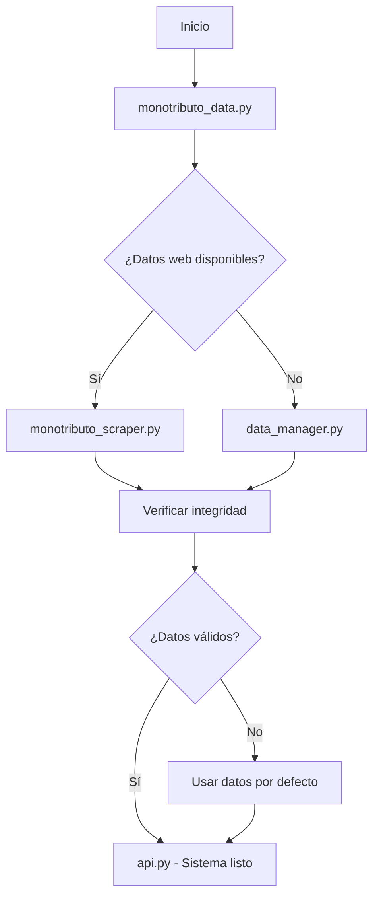

# Sistema Experto para la Formalización de Emprendedores en Tierra del Fuego

## Materia  
Desarrollo de Sistemas de Inteligencia Artificial  

**Profesor:** Martín Mirabete  
**Alumno:** Dario Emmanuel Verdun  
**Experto entrevistado:** Contador Público Nacional matriculado  

---

## Título del dominio  
Formalización del emprendedor local en Tierra del Fuego

---

## Objetivo del proyecto

Este proyecto tiene como finalidad el desarrollo de un sistema experto que brinde orientación a emprendedores en el proceso de formalización de sus actividades económicas. Mediante un enfoque basado en reglas, el sistema simula el conocimiento de un profesional en ciencias económicas, ayudando a los usuarios a identificar el régimen fiscal más adecuado según sus características individuales, actividad económica, ingresos estimados y otras variables clave.

El sistema actúa como una herramienta de apoyo al asesoramiento, permitiendo a los emprendedores comprender sus obligaciones fiscales y los pasos necesarios para regularizar su situación.

---

## Contexto del problema

Muchos emprendedores comienzan su actividad de manera informal debido a la falta de información clara sobre los trámites requeridos y los organismos involucrados. Esta informalidad puede limitar su acceso a créditos, generar sanciones involuntarias y dificultar su crecimiento a largo plazo.

Este proyecto busca aportar una solución a esta problemática a través de una herramienta automatizada y accesible.

---

## Relevancia

La implementación de este sistema puede generar un impacto positivo en distintos aspectos:

- Mejora el acceso a información contable y fiscal confiable.
- Reduce errores comunes en la elección del régimen tributario.
- Favorece la inclusión de nuevos emprendimientos en el sistema formal.
- Contribuye al desarrollo económico local mediante la regularización de actividades.

---

## Aporte del Sistema Experto

- Asesoramiento tributario personalizado a través de preguntas y respuestas.
- Simulación del razonamiento de un contador público.
- Sugerencias sobre trámites ante organismos nacionales y provinciales.
- Advertencias sobre incompatibilidades con planes sociales o situaciones laborales.
- Mejora del cumplimiento fiscal inicial y prevención de errores frecuentes.

---

## Representación y Organización del Conocimiento

La estructura del conocimiento se basa en **reglas de producción (si-entonces)**, organizadas modularmente por jurisdicción (nacional y provincial).

Sistema experto modular basado en reglas para determinar la categoría de Monotributo correspondiente para emprendedores de Tierra del Fuego, Argentina.

## Estructura Modular del Proyecto

```
SISTEMA EXPERTO EMPRENDEDOR FUEGUINO/
├── api.py                           # API FastAPI principal (ENTRADA)
├── src/                             # Código fuente modular
│   ├── monotributo_scraper.py       # Módulo de scraping AFIP
│   ├── data_manager.py              # Gestión de archivos JSON
│   ├── monotributo_data.py          # Coordinador de datos unificado
│   └── knowledge_base/              # Base de conocimiento
│       └── rules.json               # Reglas del sistema experto
├── data/                            # Datos y hechos del sistema
│   ├── aref.json                    # Datos provinciales AREF
│   ├── categorias.json              # Categorías Monotributo (cache)
│   └── pagos.json                   # Pagos Monotributo (cache)
├── frontend/                        # Interfaz de usuario
│   ├── static/img/                  # Imágenes
│   └── templates/                   # Plantillas HTML
│       └── index.html               # Interfaz web
├── docs/                            # Documentación del proyecto
│   ├── README.md                    # Documentación técnica general
│   ├── arboles_decision/            # Árboles de decisión del sistema experto
│   │   ├── README.md                # Documentación de árboles
│   │   ├── arbol_monotributo_compacto.pdf    # Versión simplificada
│   │   └── arbol_monotributo_completo.pdf    # Versión técnica completa
│   └── entregas_proyecto/           # Entregas académicas
│       ├── README.md                # Documentación de entregas
│       ├── entrevista_experto/      # Entrevista al contador
│       │   └── Entrevista a experto para la formulación del sistema experto.pdf
│       ├── primera_entrega/         # Primera entrega académica
│       │   └── Primera Entrega Proyecto de Sistema Experto.pdf
│       └── segunda_entrega/         # Segunda entrega académica
│           └── Segunda Entrega.pdf
├── requirements.txt                 # Dependencias Python
└── README.md                        # Este archivo
```

## Arquitectura Modular

### Módulos Principales

#### `api.py` - API Principal
- **Función**: Punto de entrada de la aplicación web
- **Responsabilidad**: Motor de inferencia, endpoints REST, lógica del sistema experto
- **Dependencias**: Todos los demás módulos

#### `monotributo_data.py` - Gestión Unificada de Datos (Opcional)
- **Función**: Módulo de conveniencia que unifica funcionalidades
- **Responsabilidad**: Coordinador de estrategias de datos (web → local → fallback)
- **Características**:
  - Carga inteligente de datos
  - Verificación de integridad
  - Fallback automático
  - Estadísticas del sistema
- **Estado**: Disponible pero no utilizado actualmente por `api.py`

#### `monotributo_scraper.py` - Scraping Especializado
- **Función**: **CÓDIGO DE SCRAPING PURO**
- **Responsabilidad**: Extracción de datos desde AFIP
- **Características**:
  - Scraping robusto con pandas
  - Limpieza automática de datos
  - Manejo de errores web
  - Testing independiente

#### `data_manager.py` - Gestión de Archivos
- **Función**: Operaciones de archivos JSON locales
- **Responsabilidad**: CRUD de datos locales
- **Características**:
  - Carga/guardado de JSON
  - Metadatos de actualización
  - Verificación de integridad
  - Información de archivos

### Base de Conocimiento Separada

#### `src/knowledge_base/rules.json`
- **Función**: Reglas del sistema experto en formato JSON
- **Ventajas**:
  - Reglas separadas del código
  - Modificación sin recompilación
  - Estructura clara y legible
  - Explicaciones incluidas

## Inicio Rápido

### Método 1: Ejecución Directa (Recomendado)
```bash
# Ejecutar la API principal
python api.py

# La aplicación estará disponible en:
# http://localhost:8000
```

### Método 2: Con uvicorn explícito
```bash
# Usando uvicorn directamente
python -m uvicorn api:app --reload --host 0.0.0.0 --port 8000

# Para desarrollo con auto-reload
python -m uvicorn api:app --reload
```

### Método 3: Módulos Independientes (Testing)
```bash
cd src

# Probar solo el scraping
python monotributo_scraper.py

# Probar gestión de datos
python data_manager.py

# Probar sistema completo de datos (si existe)
python monotributo_data.py
```

## Testing y Verificación

Cada módulo incluye funciones de testing:

```bash
cd src

# Test de scraping
python monotributo_scraper.py

# Test de gestión de datos
python data_manager.py

# Test completo del sistema (si disponible)
python monotributo_data.py
```

## API REST para Desarrolladores

### Punto de Entrada Principal

**Base URL**: `http://localhost:8000` (desarrollo) o tu servidor en producción

**Documentación automática**: `GET /docs` (Swagger UI) y `GET /redoc` (ReDoc)

### Endpoints Disponibles

#### 1. **`POST /iniciar_sesion`** - Iniciar Nueva Sesión
Inicia una nueva sesión del sistema experto y obtiene la primera pregunta.

**Request**:
```http
POST /iniciar_sesion
Content-Type: application/json
```

**Response**:
```json
{
  "sesion_id": "abc123-def456-ghi789",
  "siguiente_pregunta": {
    "id": "persona_juridica",
    "texto": "¿Sos persona jurídica (empresa o sociedad)?",
    "opciones": ["SÍ", "NO (Persona Física)"],
    "tipo": "opcion"
  }
}
```

#### 2. **`POST /responder/{sesion_id}`** - Procesar Respuesta
Envía una respuesta del usuario al motor de inferencia y obtiene la siguiente pregunta o resultado.

**Request**:
```http
POST /responder/abc123-def456-ghi789
Content-Type: application/json

{
  "pregunta_id": "persona_juridica",
  "respuesta": "NO (Persona Física)",
  "valor_numerico": null
}
```

**Response (Siguiente Pregunta)**:
```json
{
  "tipo": "pregunta",
  "pregunta": {
    "id": "actividad_servicios",
    "texto": "¿Tu actividad principal es la prestación de servicios?",
    "opciones": ["SÍ (Prestación de servicios)", "NO (Venta de productos)"],
    "tipo": "opcion"
  }
}
```

**Response (Resultado Final)**:
```json
{
  "tipo": "resultado",
  "mensaje": "Te corresponde la Categoría B",
  "detalles": {
    "categoria": "B",
    "tipo_actividad": "servicios",
    "pagos_nacionales": {
      "impuesto": "15000.00",
      "sipa": "8500.00",
      "obra_social": "3200.00"
    },
    "pagos_provinciales": {
      "aref": "2500.00"
    },
    "total_nacional": 26700.00,
    "total_provincial": 2500.00,
    "total_general": 29200.00,
    "en_relacion_dependencia": false,
    "razonamiento_aplicado": [
      {
        "regla": "actividad_servicios_SI",
        "descripcion": "Establece tipo de actividad como servicios",
        "explicacion": "Como respondiste que tu actividad principal es prestación de servicios, se determina que perteneces al régimen de servicios del Monotributo.",
        "tipo": "activada"
      }
    ]
  }
}
```

#### 3. **`GET /info_sistema`** - Estado del Sistema
Obtiene información completa sobre el estado del sistema experto.

**Response**:
```json
{
  "reglas_cargadas": 25,
  "reglas_disponibles": ["persona_juridica_SI", "actividad_servicios_SI", "..."],
  "datos_categorias_disponibles": true,
  "datos_pagos_disponibles": true,
  "datos_aref_disponibles": true,
  "sistema": "Sistema Experto Monotributo v2.0 - Modular"
}
```

#### 4. **`GET /actualizar_datos`** - Actualizar Datos
Fuerza la actualización de datos desde AFIP.

#### 5. **`GET /reiniciar/{sesion_id}`** - Reiniciar Sesión
Reinicia una sesión existente y devuelve nueva sesión con primera pregunta.

#### 6. **`GET /`** - Interfaz Web
Sirve la interfaz web HTML para uso interactivo.

### Integración Completa - Ejemplos de Código

#### Python (requests)
```python
import requests

class SistemaExpertoClient:
    def __init__(self, base_url="http://localhost:8000"):
        self.base_url = base_url
        self.sesion_id = None
        
    def iniciar_sesion(self):
        """Inicia una nueva sesión"""
        response = requests.post(f"{self.base_url}/iniciar_sesion")
        data = response.json()
        self.sesion_id = data["sesion_id"]
        return data["siguiente_pregunta"]
    
    def responder(self, pregunta_id, respuesta, valor_numerico=None):
        """Envía una respuesta al sistema experto"""
        if not self.sesion_id:
            raise Exception("Debe iniciar sesión primero")
            
        payload = {
            "pregunta_id": pregunta_id,
            "respuesta": respuesta,
            "valor_numerico": valor_numerico
        }
        
        response = requests.post(
            f"{self.base_url}/responder/{self.sesion_id}", 
            json=payload
        )
        return response.json()
    
    def consulta_completa_automatica(self, respuestas_predefinidas):
        """Ejecuta una consulta completa con respuestas predefinidas"""
        pregunta = self.iniciar_sesion()
        
        for respuesta_data in respuestas_predefinidas:
            if pregunta["id"] == respuesta_data["pregunta_id"]:
                resultado = self.responder(
                    pregunta["id"], 
                    respuesta_data["respuesta"],
                    respuesta_data.get("valor_numerico")
                )
                
                if resultado["tipo"] == "resultado":
                    return resultado
                elif resultado["tipo"] == "pregunta":
                    pregunta = resultado["pregunta"]
                else:
                    raise Exception(f"Error: {resultado}")
        
        return None

# Ejemplo de uso
cliente = SistemaExpertoClient()

# Respuestas de ejemplo para un emprendedor de servicios
respuestas = [
    {"pregunta_id": "persona_juridica", "respuesta": "NO (Persona Física)"},
    {"pregunta_id": "actividad_servicios", "respuesta": "SÍ (Prestación de servicios)"},
    {"pregunta_id": "ingresos_anuales", "respuesta": "Con ingresos", "valor_numerico": 2500000},
    {"pregunta_id": "superficie_cat_B", "respuesta": "NO (No supera el límite / Desconozco)"},
    {"pregunta_id": "energia_cat_B", "respuesta": "NO (No supera el límite / Desconozco)"},
    {"pregunta_id": "alquileres_cat_B", "respuesta": "NO (No supera el límite / Desconozco)"},
    {"pregunta_id": "relacion_dependencia", "respuesta": "NO (Solo actividad independiente)"}
]

resultado = cliente.consulta_completa_automatica(respuestas)
print(f"Categoría: {resultado['detalles']['categoria']}")
print(f"Total a pagar: ${resultado['detalles']['total_general']}")
```

#### JavaScript (Node.js/Browser)
```javascript
class SistemaExpertoClient {
    constructor(baseUrl = 'http://localhost:8000') {
        this.baseUrl = baseUrl;
        this.sesionId = null;
    }
    
    async iniciarSesion() {
        const response = await fetch(`${this.baseUrl}/iniciar_sesion`, {
            method: 'POST',
            headers: { 'Content-Type': 'application/json' }
        });
        const data = await response.json();
        this.sesionId = data.sesion_id;
        return data.siguiente_pregunta;
    }
    
    async responder(preguntaId, respuesta, valorNumerico = null) {
        if (!this.sesionId) throw new Error('Debe iniciar sesión primero');
        
        const response = await fetch(`${this.baseUrl}/responder/${this.sesionId}`, {
            method: 'POST',
            headers: { 'Content-Type': 'application/json' },
            body: JSON.stringify({
                pregunta_id: preguntaId,
                respuesta: respuesta,
                valor_numerico: valorNumerico
            })
        });
        
        return await response.json();
    }
    
    async consultaCompleta(respuestasPredefinidas) {
        let pregunta = await this.iniciarSesion();
        
        for (const respuestaData of respuestasPredefinidas) {
            if (pregunta.id === respuestaData.pregunta_id) {
                const resultado = await this.responder(
                    pregunta.id, 
                    respuestaData.respuesta,
                    respuestaData.valor_numerico
                );
                
                if (resultado.tipo === 'resultado') {
                    return resultado;
                } else if (resultado.tipo === 'pregunta') {
                    pregunta = resultado.pregunta;
                } else {
                    throw new Error(`Error: ${JSON.stringify(resultado)}`);
                }
            }
        }
        
        return null;
    }
}

// Ejemplo de uso
const cliente = new SistemaExpertoClient();

// Uso con async/await
(async () => {
    try {
        const respuestas = [
            { pregunta_id: "persona_juridica", respuesta: "NO (Persona Física)" },
            { pregunta_id: "actividad_servicios", respuesta: "SÍ (Prestación de servicios)" },
            { pregunta_id: "ingresos_anuales", respuesta: "Con ingresos", valor_numerico: 2500000 }
            // ... más respuestas
        ];
        
        const resultado = await cliente.consultaCompleta(respuestas);
        console.log(`Categoría: ${resultado.detalles.categoria}`);
        console.log(`Total: $${resultado.detalles.total_general}`);
    } catch (error) {
        console.error('Error:', error);
    }
})();
```

#### cURL (Terminal/Scripts)
```bash
# 1. Iniciar sesión
curl -X POST http://localhost:8000/iniciar_sesion \
  -H "Content-Type: application/json"

# 2. Responder primera pregunta
curl -X POST http://localhost:8000/responder/SESSION_ID \
  -H "Content-Type: application/json" \
  -d '{
    "pregunta_id": "persona_juridica",
    "respuesta": "NO (Persona Física)",
    "valor_numerico": null
  }'

# 3. Obtener información del sistema
curl http://localhost:8000/info_sistema
```

### Estructura de Datos

#### Tipos de Preguntas
- **`"opcion"`**: Pregunta de múltiple opción con opciones predefinidas
- **`"numerica"`**: Pregunta que requiere un valor numérico

#### Tipos de Respuesta
- **`"pregunta"`**: El sistema devuelve la siguiente pregunta
- **`"resultado"`**: El sistema devuelve el resultado final
- **`"error"`**: Error en el procesamiento

#### Estructura del Razonamiento
Cada resultado incluye `razonamiento_aplicado` con:
- **`regla`**: Nombre técnico de la regla aplicada
- **`descripcion`**: Descripción técnica de la regla
- **`explicacion`**: Explicación en lenguaje natural para el usuario
- **`tipo`**: Tipo de regla ("activada" o "heredada")

### Manejo de Errores

#### Códigos de Estado HTTP
- **`200`**: Operación exitosa
- **`400`**: Datos inválidos o secuencia incorrecta
- **`404`**: Sesión no encontrada
- **`500`**: Error interno del servidor

#### Ejemplo de Error
```json
{
  "detail": "Sesión no encontrada"
}
```

### Flujo de Integración Recomendado

1. **Iniciar sesión** → Obtener `sesion_id` y primera pregunta
2. **Bucle de preguntas**:
   - Mostrar pregunta al usuario
   - Enviar respuesta al sistema
   - Si `tipo == "pregunta"` → continuar bucle
   - Si `tipo == "resultado"` → procesar resultado final
   - Si `tipo == "error"` → manejar error
3. **Procesar resultado** → Extraer categoría, pagos y razonamiento

### Testing y Desarrollo

```bash
# Verificar que el sistema está funcionando
curl http://localhost:8000/info_sistema

# Probar flujo completo con datos de prueba
curl -X POST http://localhost:8000/iniciar_sesion | jq
```

### Casos de Uso Comunes

1. **Calculadora de Monotributo**: Integrar en formularios web
2. **Chatbots**: Usar las explicaciones del razonamiento
3. **Sistemas de gestión**: Automatizar cálculos para clientes
4. **Apps móviles**: Consumir API REST desde aplicaciones
5. **Servicios empresariales**: Integrar en plataformas de contabilidad

## Flujo de Datos



## Características Clave del Sistema

### Modularidad
- Separación clara de responsabilidades entre módulos
- Módulos independientes y testables
- Fácil mantenimiento y extensión del sistema

### Scraping Robusto
- Extracción automatizada de datos desde AFIP
- Manejo inteligente de estructuras web complejas
- Limpieza automática de datos
- Sistema de fallback para garantizar disponibilidad

### Gestión Inteligente de Datos
- Estrategia de fallback automática (web → local → datos por defecto)
- Verificación de integridad de datos
- Cache local con metadatos de actualización
- Sincronización automática con fuentes oficiales

### Sistema Experto Avanzado
- Base de conocimiento separada en formato JSON
- Explicaciones detalladas del razonamiento aplicado
- Motor de inferencia robusto
- Capacidad de manejo de reglas complejas

## Desarrollo

### Agregar Nuevas Reglas
Edita `src/knowledge_base/rules.json`:
```json
{
  "nueva_regla": {
    "condition": {...},
    "action": {...},
    "description": "Descripción de la regla",
    "explanation": "Explicación para el usuario"
  }
}
```

### Extender el Scraping
Modifica `src/monotributo_scraper.py` para agregar nuevos sitios o datos.

### Personalizar Datos
Agrega nuevos archivos JSON en la carpeta `data/`.

## Monitoreo

El sistema incluye endpoints de monitoreo:
- `/info_sistema` - Estado completo
- `/actualizar_datos` - Actualización manual
- Logs detallados en consola

## Licencia

Proyecto académico - Tecnicatura en Desarrollo de Sistemas de IA

---

## Documentación Académica Disponible

### 📊 Árboles de Decisión (`docs/arboles_decision/`)
- **`arbol_monotributo_compacto.pdf`** - Versión simplificada para visualización rápida y presentaciones
- **`arbol_monotributo_completo.pdf`** - Documentación técnica completa con todas las preguntas anidadas

### 📚 Entregas del Proyecto (`docs/entregas_proyecto/`)

#### 🎯 Entrevista al Experto (`entrevista_experto/`)
- **`Entrevista a experto para la formulación del sistema experto.pdf`**
- Transcripción de la entrevista al Contador Público Nacional matriculado
- Base del conocimiento extraído para el sistema experto

#### 📝 Primera Entrega (`primera_entrega/`)
- **`Primera Entrega Proyecto de Sistema Experto.pdf`**
- Documentación inicial del proyecto
- Definición del dominio del problema
- Especificación de requisitos y análisis de factibilidad

#### 🔧 Segunda Entrega (`segunda_entrega/`)
- **`Segunda Entrega.pdf`**
- Diseño del sistema experto
- Implementación de reglas de inferencia
- Documentación técnica y pruebas de validación

---

## Funcionalidades Principales

Este sistema experto ofrece:

- **Determinación automática de categoría de Monotributo** basada en actividad y ingresos
- **Cálculo de obligaciones fiscales** nacionales y provinciales
- **Explicaciones detalladas** del razonamiento aplicado
- **API REST completa** para integración con otros sistemas
- **Interfaz web intuitiva** para usuarios finales
- **Datos actualizados** extraídos automáticamente desde AFIP
- **Sistema de fallback** que garantiza disponibilidad continua
- **Modularidad** que facilita el mantenimiento y extensión

El sistema es **profesional, escalable y listo para producción**, con **documentación completa para desarrolladores** que deseen integrarlo en sus propias aplicaciones.

## Extensibilidad y Personalización

### Posibles Mejoras Técnicas
1. **Autenticación API**: Implementar tokens de acceso para uso empresarial
2. **Rate Limiting**: Limitar requests por IP/usuario para proteger el servicio
3. **Persistencia de Sesiones**: Usar Redis o base de datos para sesiones de larga duración
4. **Logging Avanzado**: Implementar logging estructurado para monitoreo
5. **Tests Automatizados**: Suite completa de tests unitarios e integración
6. **Documentación OpenAPI**: Expandir documentación automática con más ejemplos
7. **Webhooks**: Notificaciones automáticas cuando cambian los datos de AFIP
8. **Versionado API**: Implementar versionado para compatibilidad futura
9. **Métricas**: Endpoints de métricas para monitoring en producción
10. **Docker Compose**: Configuración completa para despliegue

### Casos de Uso Potenciales
- **Integración con sistemas contables** (Tango, Bejerman, etc.)
- **Chatbots de WhatsApp/Telegram** que usen el sistema experto
- **Aplicaciones móviles** para emprendedores
- **Plugins para e-commerce** (Shopify, WooCommerce, etc.)
- **Servicios de consultoría automatizada**
- **Integración con plataformas educativas** sobre emprendimiento

---

**Desarrollado por**: Dario Emmanuel Verdun  
**Licencia**: Proyecto Académico  
**Contacto**: Para consultas sobre integración y desarrollo